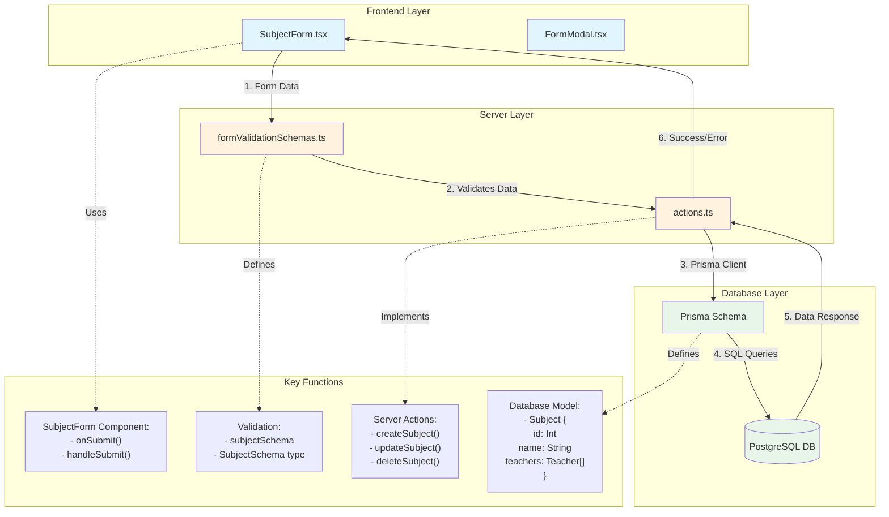

# Subject Data Flow Diagram



## Data Flow Description

1. **Frontend Layer**
   - `SubjectForm.tsx` handles form input and submission
   - Uses React Hook Form for form state management
   - Communicates with server through form actions

2. **Validation Layer**
   - `formValidationSchemas.ts` defines Zod schema
   - Validates subject name and teacher relationships
   - Ensures data integrity before server processing

3. **Server Actions Layer**
   - `actions.ts` contains server-side functions
   - Handles CRUD operations (Create, Read, Update, Delete)
   - Manages database transactions through Prisma

4. **Database Layer**
   - Prisma schema defines Subject model
   - Handles many-to-many relationship with Teachers
   - Stores data in PostgreSQL database

## Key Functions and Their Roles

### Frontend Functions (SubjectForm.tsx)
- `onSubmit`: Handles form submission
- `handleSubmit`: React Hook Form submission handler
- Uses `useFormState` for server action state management

### Validation (formValidationSchemas.ts)
```typescript
export const subjectSchema = z.object({
  id: z.coerce.number().optional(),
  name: z.string().min(1),
  teachers: z.array(z.string())
});
```

### Server Actions (actions.ts)
```typescript
export const createSubject = async (
  currentState: CurrentState,
  data: SubjectSchema
) => {
  // Creates new subject with teacher connections
}

export const updateSubject = async (
  currentState: CurrentState,
  data: SubjectSchema
) => {
  // Updates existing subject and teacher relationships
}

export const deleteSubject = async (
  currentState: CurrentState,
  data: FormData
) => {
  // Deletes subject and removes relationships
}
```

### Database Schema (schema.prisma)
```prisma
model Subject {
  id       Int       @id @default(autoincrement())
  name     String    @unique
  teachers Teacher[]
  lessons  Lesson[]
}
